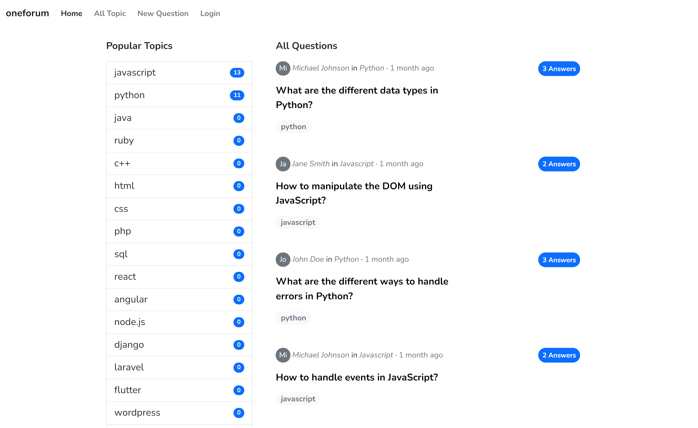
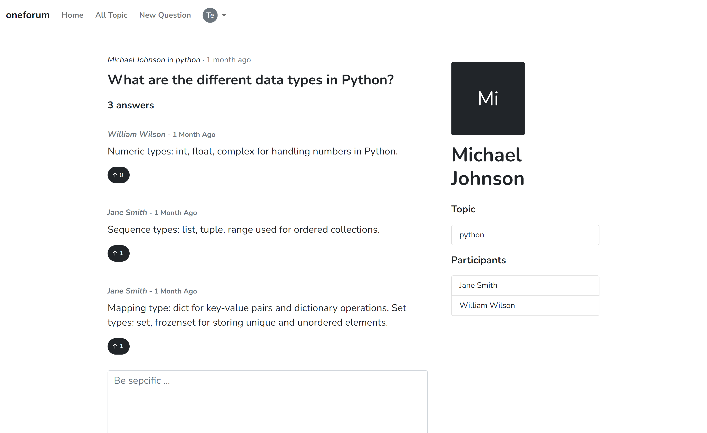
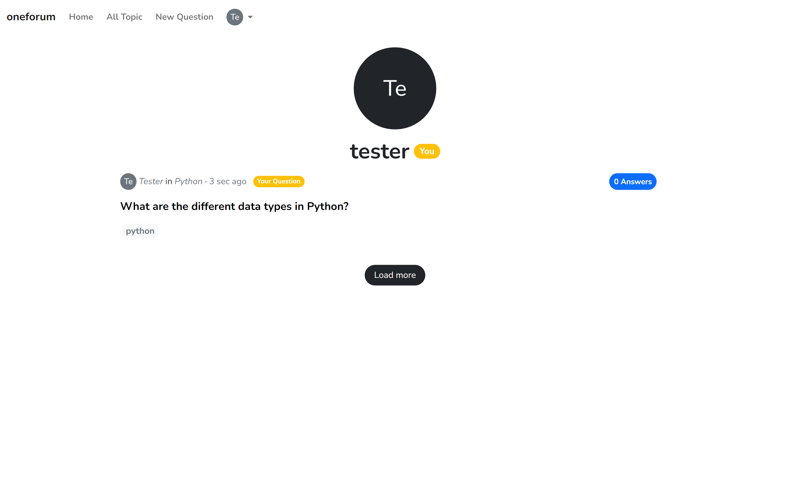
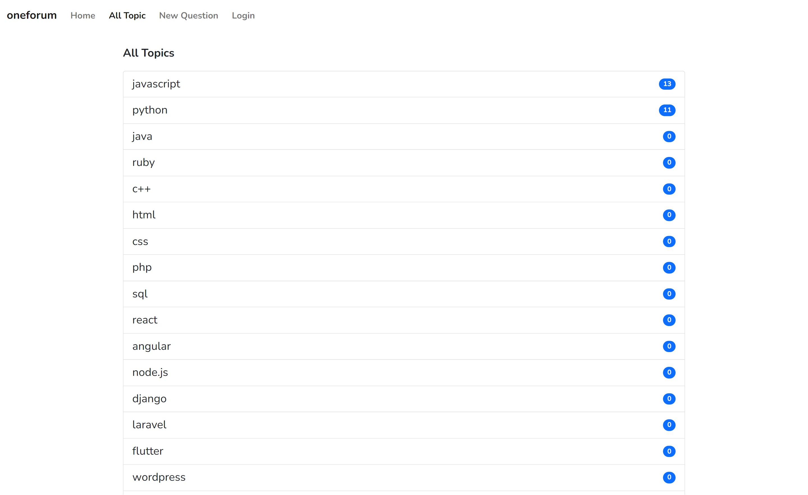

# oneforum

A online discussion forum implemented using spring-boot backend and react client, this is a demo project and it is implemented for production.

## How to run?

- Run the spring-boot backend using eclipse or using `.\mvnw spring-boot:run` in terminal
- MySql is used as a database, if MySql server is not running use H2 database of spring boot
- Finally, run the react client

## Screenshots

## Links

[For more screenshots, go to ./screenshots folder](./screenshots/)